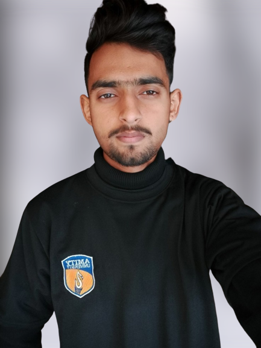

  

<h1 align="center">Hi, I'm Vaibhav Pratap Singh Kushwah  </h1>

  <b><i>🚀 Passionate about code | 👨‍💻 Always building | 🔭 Exploring the tech universe</i></b>

  <b><i>🧠 Tech Explorer | 🎮 Gamer at heart</i></b>

---

### 🌟 About Me

- 🎓 Currently pursuing B.Tech at **Amity University, Madhya Pradesh**
- 🔍 I love to explore **DSA**, **Web Development**, and **Creative Tech Projects**
- 🤝 Passionate about learning from people across the world
- 📫 Reach me at: **vaibhav.p.s.kushwah15@gmail.com**

---

### 🧠 Languages & Frameworks

  
  
  
  
  
  
  

---

### 🛠️ Tools & Platforms

  
  
  
  <!-- Badges for tools not in devicon -->
  
  
  
  
  

---

### 🛠️ Projects

- 🎨 **Web Development:** Responsive websites, forms, UI components  
- 🔊 **Canvas Audio Visualizer:** Real-time animated music ring using JavaScript  
- ⚙️ **OOP Projects:** Bank Management System, file handling, and object interaction

---

### 🎯 Goals

- 📦 Build real-world, impactful software projects  
- 💡 Contribute to meaningful open-source repositories  
- 🎯 Secure a tech internship or full-time developer role  
- 🧠 Stay consistent with DSA and CS fundamentals  

---

### 📊 GitHub Stats
  
  

---

### 🔗 Connect with Me

  
  
  

---

